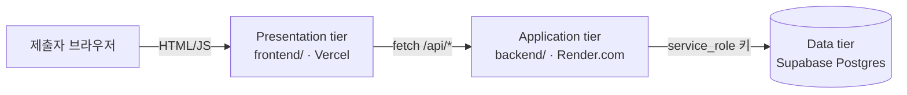

# suj-form-app — 정책 애로사항 건의 접수 (3-tier)

`docs/suj_form.html`(정적 mailto 양식)을 실제 접수 이력이 서버에 남는 3계층(3-tier) 프로그램으로 재구성한 것입니다.
`docs/suj_form.html`은 그대로 두었습니다 (GitHub Pages로 배포되는 슬라이드 자료와 같은 폴더라 편집 대상이 아닙니다).
이 폴더가 실제로 배포·운영하는 버전입니다.

> 다음 단계 개선 과제(우선순위 포함)는 [`PRD.md`](PRD.md)를 참고하세요.

## 구조 (3-tier)



| 계층 | 폴더 | 배포처 | 역할 |
|---|---|---|---|
| Presentation | [`frontend/`](frontend/) | Vercel (정적 사이트) | 접수 폼 + 접수번호 조회 화면 + [내부 접수 목록 조회](#내부-접수-목록-조회-adminhtml). DB에 직접 접근하지 않고 백엔드 API만 호출 |
| Application | [`backend/`](backend/) | Render.com (Node 웹 서비스) | 입력값 검증, 접수번호(`EDPA-연도-번호`) 채번, Supabase 호출, 속도 제한 |
| Data | [`supabase/schema.sql`](supabase/schema.sql) | Supabase (Postgres) | `complaints` 테이블. RLS로 잠겨 있어 서비스 키를 가진 백엔드만 접근 가능 |

프런트가 Supabase에 직접 붙지 않고 반드시 백엔드를 거치도록 만든 것이 이 구조의 핵심입니다 — anon 키를 브라우저에 노출하지 않고, 검증·속도 제한·접수번호 채번 로직을 한 곳(Application tier)에 모을 수 있습니다.

## 배포 순서

### 1. Supabase (Data tier)

1. [supabase.com](https://supabase.com) 에서 새 프로젝트 생성
2. 대시보드 → **SQL Editor** → [`supabase/schema.sql`](supabase/schema.sql) 전체 붙여넣고 실행
3. **Project Settings → API** 에서 `Project URL`과 `service_role` 키를 복사해 둠 (service_role 키는 절대 프런트엔드나 공개 저장소에 넣지 않습니다)

### 2. Render.com (Application tier)

1. [render.com](https://render.com) → New → Web Service → 이 저장소 연결
2. Root Directory: `Tool/suj-form-app/backend` (또는 [`backend/render.yaml`](backend/render.yaml)을 Blueprint로 사용)
3. Environment 탭에서 환경변수 등록 ([`backend/.env.example`](backend/.env.example) 참고):
   - `SUPABASE_URL`
   - `SUPABASE_SERVICE_ROLE_KEY`
   - `ALLOWED_ORIGIN` — 3단계에서 만들 Vercel 주소 (예: `https://suj-form.vercel.app`). 아직 모르면 임시로 비워두고, Vercel 배포 후 다시 채워 재배포
4. 배포 완료 후 `https://<서비스명>.onrender.com/health` 접속해 `{"ok":true}` 확인

### 3. Vercel (Presentation tier)

1. [`frontend/config.js`](frontend/config.js)의 `API_BASE_URL`을 2단계에서 받은 Render 주소로 수정 후 커밋
2. [vercel.com](https://vercel.com) → New Project → 이 저장소 연결, Root Directory를 `Tool/suj-form-app/frontend`로 지정 (빌드 명령 없음, 정적 파일 그대로 배포)
3. 배포된 주소를 Render의 `ALLOWED_ORIGIN`에 넣고 백엔드 재배포 (CORS 허용)

### 4. 동작 확인

- 배포된 Vercel 주소에서 폼 제출 → "접수번호: EDPA-2026-0001" 형태 메시지 확인
- Supabase 대시보드 → Table Editor → `complaints`에 행이 생겼는지 확인
- 같은 접수번호 + 연락처로 페이지 하단 "처리 현황 확인"에서 조회되는지 확인
- 필수 항목을 비운 채 제출 시 저장되지 않고 안내 메시지만 뜨는지 확인 (오류 샘플)

## 내부 접수 목록 조회 (`admin.html`)

담당자가 접수된 건을 한 화면에서 훑어보고, 처리 상태를 바꾸고, 엑셀(CSV)로 내려받기 위한 간단한 화면입니다. `Tool/complaint_management_system.html`(회원사·처리이력·정책건의까지 다루는 별도의 본격 관리자 도구)과는 다른, 훨씬 가벼운 화면입니다.

- 위치: `frontend/admin.html` → 배포 후 `https://<Vercel 주소>/admin.html`
- 보호 방식: 공개 접수 폼과 달리 인증이 필요합니다. Render 환경변수 `ADMIN_KEY`에 임의의 긴 문자열을 설정하면, `admin.html`에서 그 값을 입력해야 목록이 보입니다. `ADMIN_KEY`를 설정하지 않으면 `/api/admin/*`가 통째로 비활성화됩니다.
- 이 페이지는 nav 메뉴 등으로 링크되어 있지 않습니다 — URL과 접근 키를 아는 사람만 씁니다. 접근 키는 코드/커밋에 넣지 말고 담당자에게 별도로 전달하세요.
- **상태 변경**: 목록의 "상태" 칸이 드롭다운입니다. 바꾸면 즉시 `PATCH /api/admin/complaints/:receiptNo/status`를 호출해 Supabase에 저장됩니다(값은 `schema.sql`의 7단계로 제한).
- **엑셀 다운로드**: "⬇ 엑셀 다운로드" 버튼이 현재 화면에 로드된 목록을 UTF-8 BOM 포함 CSV로 내려받습니다(Excel에서 바로 열림). 첨부파일 다운로드는 아직 없습니다 — 공개 폼이 파일을 아예 받지 않고(증빙 자료는 담당자에게 별도 전달) Supabase에도 파일 저장소가 연결돼 있지 않기 때문입니다. 필요해지면 공개 폼에 파일 입력을 추가하고 Supabase Storage를 연동하는 별도 작업이 필요합니다.

## 로컬에서 백엔드만 먼저 확인하고 싶다면

```bash
cd Tool/suj-form-app/backend
npm install
cp .env.example .env   # 값 채우기
npm start
curl -X POST http://localhost:3000/api/complaints \
  -H "Content-Type: application/json" \
  -d '{"org":"테스트","contact-name":"홍길동","contact-phone":"010-0000-0000","summary":"테스트 접수","detail":"로컬 확인용","has-evidence":"없음","urgent":"일반"}'
```

## 알려진 한계

- 첨부파일 업로드는 아직 없습니다. 증빙 자료는 접수 후 담당자에게 별도로 전달하는 방식입니다 (필요해지면 Supabase Storage 연동으로 확장 가능).
- 접수 상태(`status`)는 기본값 `접수`로 생성되며, `admin.html`에서 드롭다운으로 바꿀 수 있습니다(값 7종 고정). `Tool/complaint_management_system.html`(회원사·처리이력·정책건의까지 다루는 별도의 본격 관리자 도구, localStorage 기반)과 이 DB를 연동하는 것은 별도의 더 큰 작업으로 남겨둡니다.
- `admin.html`의 접근 제어는 공유 키 하나로 여는 최소한의 방식입니다(로그인·역할 구분 없음). 여러 담당자가 각자 로그인하고 권한을 나누는 화면이 필요해지면 Supabase Auth 도입을 권장합니다.

## 버전과 변경 기록

| 버전 | 날짜 | 변경 내용 |
|---|---|---|
| v1.0 | 2026-08-20 | 최초 제작 — `docs/suj_form.html`(정적 mailto 양식)을 Vercel(프런트)·Render(백엔드)·Supabase(DB) 3-tier로 재구성. 접수번호 자동 채번, 접수번호+연락처 처리 현황 조회 추가 |
| v1.1 | 2026-08-20 | 내부용 접수 목록 조회 화면(`frontend/admin.html`) 및 보호된 목록 API(`GET /api/admin/complaints`, `ADMIN_KEY` 필요) 추가. Render `trust proxy` 설정 추가 |
| v1.2 | 2026-08-20 | `admin.html`에 상태 변경(드롭다운 → `PATCH /api/admin/complaints/:receiptNo/status`)과 엑셀(CSV) 다운로드 추가 |
