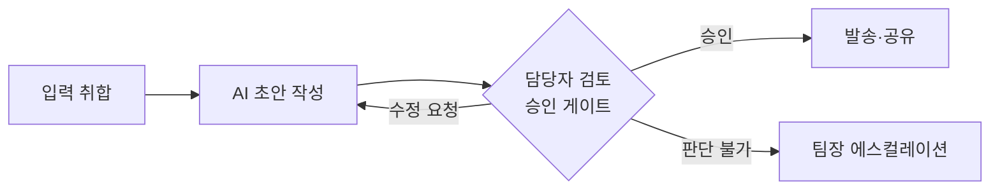

# Workflow/ — 업무 흐름도 · RACI · 예외 경로

내 업무가 **어떤 순서로 흐르고, 어디서 사람이 승인하는지**를 그림과 표로 남기는 폴더입니다.

## 언제 무엇을 넣나

| 날짜 | 넣는 것 | 권장 파일 이름 |
|------|------|------|
| 2일 과제 | **업무 흐름도(Mermaid)** — 사람이 승인하는 지점(게이트)과 지연·긴급 대응 규칙 표기 | `workflow.md` |
| 3일 실습 2 | **RACI 표**(잘못됐을 때 누가 무엇을 하는가) · **예외 경로** | `raci.md` |

## 흐름도 만드는 법

Claude에게 업무 순서를 말로 설명하면 Mermaid 도식을 만들어 줍니다. 아래처럼 마크다운 파일에 붙여 넣으면 GitHub 화면에서 그림으로 보입니다.

- **승인 게이트**는 반드시 이름 또는 역할로 표시합니다 (예: "팀장 검토").
- 외부(고객·타 부서)로 나가는 산출물 앞에는 예외 없이 사람의 승인이 있어야 합니다.

## RACI 표 틀

| 단계 | R (실행) | A (책임·승인) | C (협의) | I (통보) |
|------|------|------|------|------|
| 입력 취합 | | | | |
| AI 초안 작성 | | | | |
| 검토·승인 | | | | |
| 발송·공유 | | | | |
| **잘못됐을 때** (오류 발견·회수) | | | | |

## 샘플 (가상 사례: 주간 업무 보고 자동화)

| 파일 | 무엇 |
|------|------|
| [`sample_workflow.md`](sample_workflow.md) | Mermaid 흐름도 — 승인 게이트·대행 게이트, 게이트 표, 지연·긴급 대응 규칙 5개 |
| [`sample_raci.md`](sample_raci.md) | RACI 표 + 예외 경로("잘못됐을 때 누가 무엇을") + 자산 소유자 |
