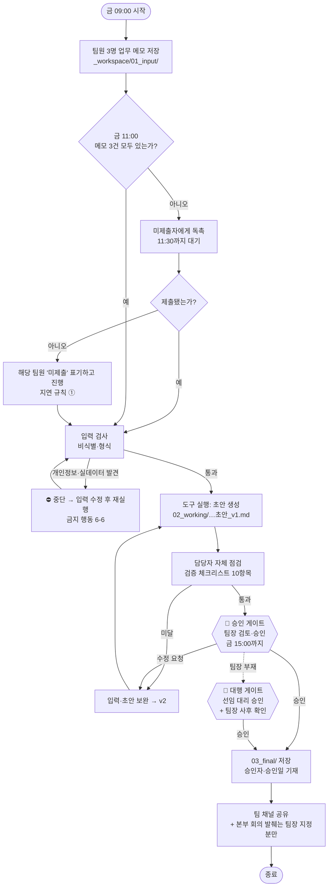

# 업무 흐름도 — 주간 업무 보고 자동화 (샘플)

> 📎 **샘플(가상 사례)** — 2일차 과제 "내 업무의 흐름도(Mermaid)"의 예시입니다. Claude에게 "매주 금요일 오전에 팀원 메모를 모아 초안을 만들고 팀장이 승인한 뒤 공유한다. 사람이 승인하는 지점과 지연·긴급 규칙을 표시해서 Mermaid로 그려 줘"라고 말해 만들고, 두 번 고쳤습니다. GitHub 화면에서 그림으로 보입니다.

## 흐름도

## 게이트 정리 (사람이 확인·승인하는 지점)

| 게이트 | 누가 | 무엇을 확인 | 통과 기준 | 통과 못하면 |
|------|------|------|------|------|
| **입력 검사** (D) | 담당자 이하늘 (도구가 1차 자동) | 메모 3건 존재·형식·비식별 | 개인정보 패턴 0건, 빈 메모 0건 | 중단 → 입력 수정 후 재실행 |
| **자체 점검** (F) | 담당자 이하늘 | 검증 체크리스트 10항목 (`Outputs/sample_checklist.md`) | 10/10 통과 (수치 항목은 원본 대조 완료) | 보완 후 v2 생성 |
| **🚧 승인 게이트** (G) | 김가온 팀장 | 지연 사유 표현 · 대외 공유 범위 · 팀장 결정 사항 기재 | 팀장 "승인" 표기 | 수정 요청 → F1 |
| **대행 게이트** (G2) | 선임 대리 (팀장 부재 시) | 위와 같음 | 대행 승인 + 팀장 사후 확인(다음 근무일) | 본부 발췌는 보류 |

## 지연·긴급 대응 규칙

| 상황 | 규칙 |
|------|------|
| ① 메모 미제출 (금 11:30 이후) | 해당 팀원 항목을 `[미제출]`로 표기하고 초안 진행. 승인본에도 미제출 표기 유지 — 지어내지 않는다 |
| ② 팀장 승인 지연 (금 15:00 초과) | 팀 채널 공유는 보류. 본부 회의(월 09:00) 전까지 승인 없으면 대행 게이트(G2) 가동 |
| ③ 긴급 — 임원이 금요일 오전 중 현황 요청 | 도구 초안을 그대로 보내지 않는다. 팀장이 초안을 보고 구두/요약으로 직접 보고. 문서 공유는 승인 후 |
| ④ 도구 오류·중단 반복 | 같은 오류 2회 반복 시 도구 사용 중단, 지난주 양식에 수동 작성. `Tool/sample_USAGE.md` 검증 기록과 함께 Claude Code에 수리 요청 |
| ⑤ 실데이터·개인정보 발견 | 즉시 중단·삭제 후 재실행. 저장소에 커밋됐다면 팀장 보고 (중단 조건 해당) |

| 버전 | 날짜 | 변경 |
|------|------|------|
| v0.1 | 2026-08-19 | 2일차 과제 — 초안 (Claude가 그린 도식 1차) |
| v0.2 | 2026-08-19 | 대행 게이트·긴급 규칙 ③ 추가 (페어 리뷰) |
| v1.0 | 2026-08-20 | 3일차 실습 1 리캡에서 확정, 도구 실행 단계(E) 파일 경로 반영 |
