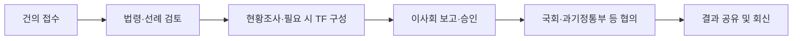

# 정책 애로사항 건의 가이드라인 (산업계용)

> 전자문서산업계 회원사·관계자가 애로사항을 제출할 때 참고하는 안내문입니다.
> 협회 내부 처리 절차는 `[workflow.md](workflow.md)`·`[raci.md](raci.md)`를, 협회의 처리 원칙은
> `[../Skills/prohibited.md](../Skills/prohibited.md)`·`[../Skills/exceptions.md](../Skills/exceptions.md)`를 참고하세요.

## 1. 어떤 내용을 건의할 수 있나요

- 법령·제도·행정 절차상 전자문서산업 관련 규제나 불합리한 부분
- 정부·지자체·유관기관 사업 참여 시 겪은 어려움
- 업계 공통으로 반복되는 절차·서류상의 불편
- 새로운 제도 도입이 필요하다고 판단되는 사안

> 개별 기업 간 상거래 분쟁, 협회 회원 자격·회비 등 협회 운영 관련 민원은 이 절차의 대상이 아닙니다. 해당 문의는 별도 창구로 안내해 드립니다.

## 2. 접수 방법

| 채널               | 이용 시점                                  |
| ---------------- | -------------------------------------- |
| 온라인 상시 접수(표준 양식) | 가장 권장 — 접수 이력이 자동으로 남아 처리 현황 조회가 가능합니다 |
| 간담회·설명회 발언       | 정기 간담회 참석 시                            |
| 유선 문의            | 양식 작성이 어려운 경우, 담당자가 대신 접수해 드립니다        |
| 대면 미팅            | 사안이 복잡하거나 자료 설명이 필요한 경우                |

## 3. 건의서에 반드시 포함할 내용 (표준 양식 항목)

1. **제출 회사/단체명 및 담당자 연락처** (내부 처리용, 외부 공개 시 비식별 처리됩니다)
2. **애로사항 요약** (한두 문장)
3. **관련 법령·제도명** (알고 있는 범위에서)
4. **구체적 사례** (언제, 어떤 절차에서, 무엇이 문제였는지 — 날짜·기관명 포함)
5. **희망하는 개선 방향** (선택 사항이나 작성 시 검토가 빨라집니다)
6. **증빙 자료** (관련 공문, 안내문 등이 있으면 첨부)

## 4. 작성 시 유의사항

- 사실관계 위주로 작성해 주세요. 추측이나 타 기관·개인에 대한 평가성 표현은 검토 과정에서 제외될 수 있습니다.
- 여러 건의 애로사항은 사안별로 나누어 각각 접수해 주세요 — 처리 속도가 빨라집니다.
- 이미 접수한 사안과 동일한 건은 새로 접수하지 마시고, 처리 현황에서 진행 상황을 확인해 주세요(6번 참고).

## 5. 접수 이후 처리 절차 (간단 안내)

- 자세한 내부 절차는 `[workflow.md](workflow.md)`를 참고하세요.
- 법령 저촉이 명백하거나 협회 소관이 아닌 사안은 검토 단계에서 사유와 함께 반려·안내될 수 있습니다.

## 6. 처리 현황 확인 방법

- 온라인 접수 시 부여되는 접수번호로 처리 현황을 조회할 수 있습니다.
- 유선·대면으로 접수한 경우 담당자에게 접수번호를 문의하시면 안내해 드립니다.
- 처리에는 사안의 난이도에 따라 수 주에서 수개월이 소요될 수 있습니다. 진행 중인 사안은 "협의 중" 등으로 표시됩니다.

## 7. 자주 묻는 질문

| 질문                       | 답변                                                                       |
| ------------------------ | ------------------------------------------------------------------------ |
| 건의한 내용이 정책에 반영된다고 보장되나요? | 아닙니다. 협회는 산업계 의견을 근거로 정책건의를 하지만, 최종 반영 여부는 국회·정부 결정 사항입니다.               |
| 제출자 정보가 외부에 공개되나요?       | 아닙니다. 대외 공유 자료에는 회사명만 표기되고 담당자 실명·연락처는 비식별 처리됩니다.                        |
| 처리 결과를 언제 알 수 있나요?       | 각 단계가 종료될 때마다 처리 현황이 갱신됩니다. 최종 결과는 공청회·보도자료 등을 통해서도 공유됩니다.               |
| 긴급한 사안은 어떻게 하나요?         | 유선으로 먼저 연락 주시면 긴급 여부를 판단해 별도 절차(`../Skills/exceptions.md` #1)로 안내해 드립니다. |

## 8. 문의처

- 담당 부서: (담당 부서명 기재)
- 접수 채널: (온라인 접수 URL 기재), 유선 (전화번호 기재)

| 버전   | 날짜         | 변경                                                                      |
| ---- | ---------- | ----------------------------------------------------------------------- |
| v1.0 | 2026-08-18 | 최초 작성 — `workflow.md`·`raci.md`·`../Skills/exceptions.md` 기반 산업계용 가이드라인 |

