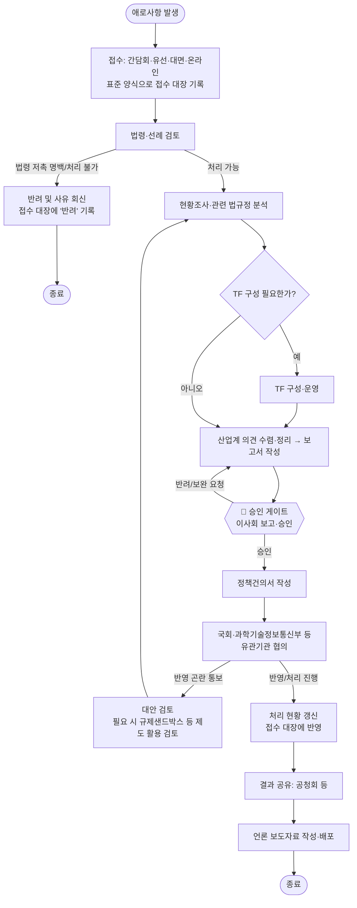

# 업무 흐름도 — 전자문서산업계 애로사항 접수 및 정책건의

> `Outputs/업무개요.md`(스킬 v0)의 작업 절차를 기반으로 그린 흐름도입니다. 팀장·이사회 등 실제 직함/성명은
> 자리표시자이니 소속 조직에 맞게 바꿔서 사용하세요.

## 흐름도

## 게이트 정리 (사람이 확인·승인하는 지점)

| 게이트 | 누가 | 무엇을 확인 | 통과 기준 | 통과 못하면 |
|------|------|------|------|------|
| **법령·선례 검토** (C) | 담당자(본인) | 법령 저촉 여부, 선례 존재 여부 | 처리 가능/불가 판단 근거 기록 | 반려 및 사유 회신 |
| **🚧 승인 게이트** (G) | 팀장·이사회 | 현황조사·법규정 분석 근거, 산업계 의견 수렴 결과, 건의 방향 | 이사회 "승인" 의결 | 보완 요청 → 보고서 재작성 |
| **대외 협의 결과 확인** (I) | 담당자(본인) + 팀장 | 국회·과기정통부 등의 반영 가능성 회신 | 반영/처리 진행 확정 | 대안 검토 또는 현황조사 단계로 회귀 |

## 지연·긴급 대응 규칙

| 상황 | 규칙 |
|------|------|
| ① 접수 채널별 애로사항이 중복 접수됨 | 접수 대장에서 동일 사안으로 병합 처리, 최초 접수일 기준으로 처리기한 산정 |
| ② 이사회 일정 지연으로 승인 게이트 통과 지연 | 임시 서면 결의 또는 차기 이사회로 이월 — 건의인에게 지연 사유와 예상 일정을 처리 현황에 공지 |
| ③ 국회·과기정통부 회신이 장기간(예: 1개월 이상) 지연 | 담당 창구에 진행 상황 재확인 공문 발송, 처리 현황에 "협의 중(지연)" 표기 |
| ④ 긴급 — 언론·국회에서 즉시 입장 요청 | 이사회 사전 승인 없이 공식 입장을 표명하지 않는다. 팀장이 구두로 1차 대응, 공식 자료는 승인 후 배포 |
| ⑤ 법령 저촉 등으로 처리 불가 판정된 사안이 재접수됨 | 기존 반려 사유를 접수 대장에서 확인 후, 사정 변경이 없으면 동일 사유로 재반려 |

| 버전 | 날짜 | 변경 |
|------|------|------|
| v1.0 | 2026-08-18 | 최초 작성 — `Outputs/업무개요.md`(스킬 v0) 절차 기반, `Outputs/타협회현황조사.md` 반영(처리 현황 조회) |
